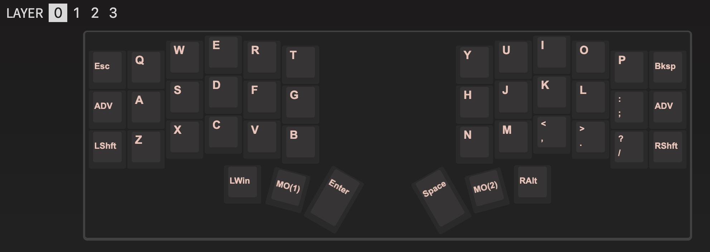
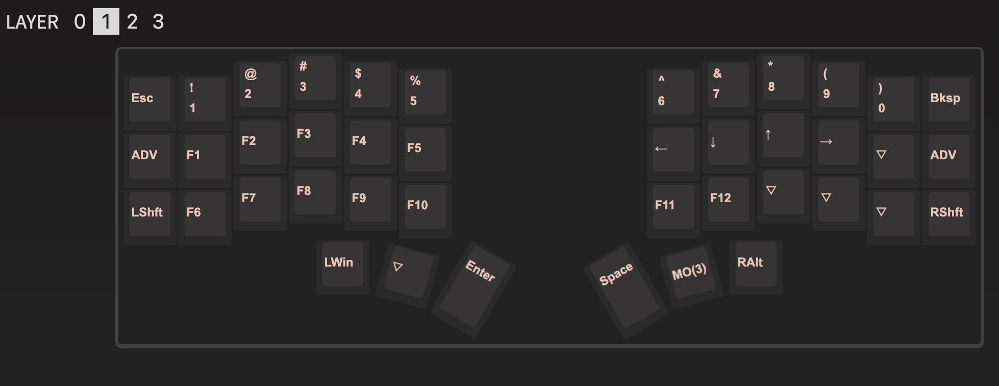
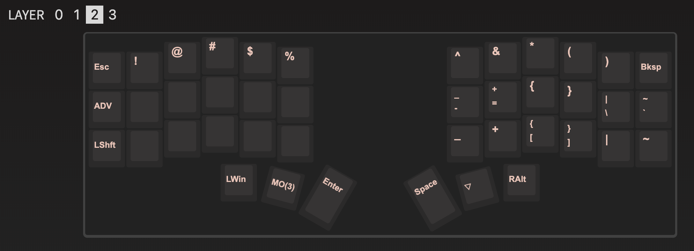
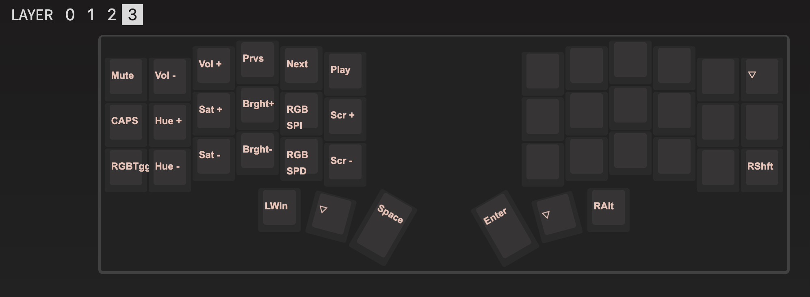

## crkbd QMK Keymap

QMK Keymap for [Corne's v3 build](https://github.com/foostan/crkbd/blob/main/corne-cherry/doc/v3/buildguide_en.md).

### Features

- Oleds indicators for: Logo, Name, Layers, modifiers
- Leds indicator for: Layers, Caps Lock
- [Via]() support


### Mappings





### Setup

After you followed [QMK Setup guide](https://beta.docs.qmk.fm/tutorial/newbs_getting_started) you add this keymap to your `qmk_firmaware` repository folder

```bash
# qmk_firmware
git submodule add https://github.com/mtoohey31/qmk-crkbd-keymap keyboards/crkbd/keymaps/edder
```

To compile keymap

```bash
make crkbd/rev1:edder
# for Elite-C needs DFU
make crkbd/rev1:edder:dfu
```
****
